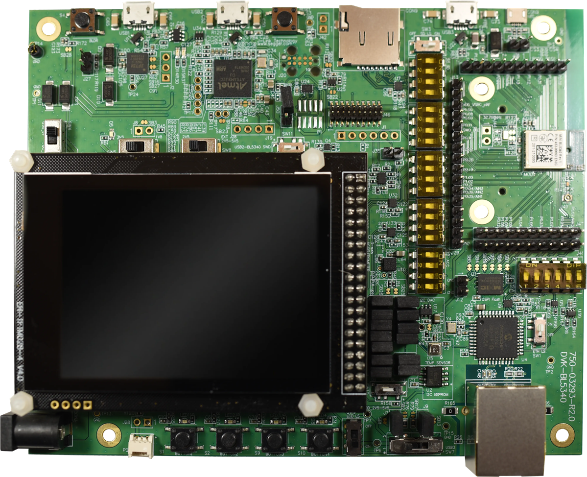

<logo></logo><logo></logo>
#  BL5340 Firmware

<table>
  <tr>
    <th align="center">
      
       
      BL5340 DVK (<a href="https://www.ezurio.com/part/453-00052-k1">453-00052-k1</a>)
    </th>
    <th align="left">
      <h2>Description</h2>
      Ezurio’s BL5340 development kits provide a platform for rapid prototyping of BL5340 modules. The development boards provide simple, easy-to-use access to the various hardware interfaces and configuration options for the modules. These DVKs are the perfect platform to provide early development testing of BL5340 features and functionality.  
      Please visit the product page on <a href="https://www.ezurio.com/wireless-modules/bluetooth-modules/bluetooth-5-modules/bl5340-series-multi-core-bluetooth-52-802154-nfc-modules">ezurio.com</a> for more details.
      <h2>Key Specs</h2>
      <table>
        <tr>
          <td><i>Internal Flash</i></td>
          <td>1024 kB</td>
          <td></td>
          <td><i>Internal RAM</i></td>
          <td>512 kB</td>
        </tr>
        <tr>
          <td><i>SPI Flash</i></td>
          <td>8192 kB</td>
          <td></td>
          <td><i>Default REPL Port</i></td>
          <td>nRF USB</td>
        </tr>
        <tr>
          <td><i>Python Heap Size</i></td>
          <td>~264 kB</td>
          <td></td>
          <td><i>Filesystem Size</i></td>
          <td>6144 kB</td>
        </tr>
      </table>
      <h2>External Links</h2>
      <a href="https://www.ezurio.com/documentation/datasheet-bl5340-series">BL5340 Series Datasheet</a> 
      <a href="https://www.ezurio.com/documentation/user-guide-bl5340-development-kit">BL5340 DVK User Guide</a>
    </th>
  </tr>
</table>

## Pinout Diagram [🔗](#pinout_diagram)

## Canvas Features [🔗](#canvas_features)
| | | | | | | | |
|--:|:--|---|--:|:--|---|--:|:-- |
|  | Bootloader           | |  | OTA Update                | |  | RTC                       |
|  | SPI                  | |  | ADC                       | |  | PWM                       |
|  | I2C                  | |  | GPIO                      | |  | UART                      |
|  | JSON *               | |  | CBOR                      | |  | NFC Tag                   |
|  | RE *                 | |  | Floating Point            | |  | Watchdog Timer            |
|  | BLE Advertiser       | |  | BLE Scanner               | |  | BLE Connection            |
|  | .zip App Update      | |  | mbedTLS                   | |  |                           |

\* Available on gateway build variants

## Hardware-Specific Features [🔗](#hardware_specific_features)
| | | | | | | | |
|--:|:--|---|--:|:--|---|--:|:--|
|  | USB          | |    | RTOS Shell       | |    | Encrypted FS     |
|  | Modem        | |   | Ethernet *       | |    | Wi-Fi Station    |
|  | Wi-Fi AP     | |   | Net Client *     | |   | * Net Server     |
|  | UWB Ranging  | |    | LED Strip Driver | |   |                  |

\* Available on gateway build variants

## Design Guidelines [🔗](#design_guidelines)
**IMPORTANT**
- Pin P1.11 is used by the mcuboot bootloader to enter recovery mode when logic low at boot.
- GPIO pin expander pin 7 (LED4) is used by the mcuboot bootloader as its LED indicator. This will be active high if in bootloader recovery mode.

## Build Variants [🔗](#build_variants)
Firmware versions containing `a.b.99` are development builds and may not be suitable for production use.

| | |
|--:|:--|
| dvk                         | Default DVK build |
| dvk_gateway                 | Includes networking support via the DVK's Ethernet interface |

---
© Copyright 2025 Ezurio LLC
