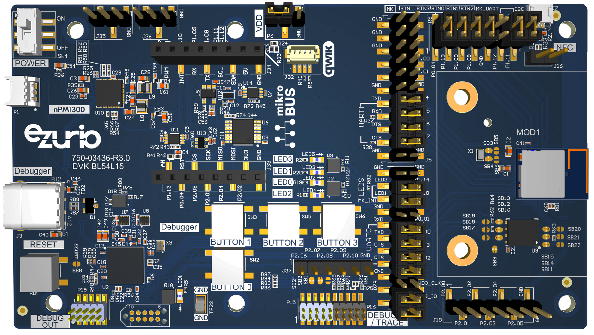

<logo></logo><logo></logo>
#  BL54L15/BL54L15µ Firmware

<table>
  <tr>
    <th align="center">
      
       
      BL54L15 DVK (<a href="https://www.ezurio.com/part/453-00001-k1">453-00001-K1</a>)
    </th>
    <th align="left">
      <h2>Description</h2>
      The Ezurio DVK for the BL54L15 modules series provides a platform for rapid wireless connectivity prototyping. The Canvas Software Suite firmware provides a Python scripting environment with simplified API access to chipset peripherals and wireless connectivity features.  
      Please visit the product page on <a href="https://www.ezurio.com/product/bl54l15-series-bluetooth-le-80215-4-nfc">ezurio.com</a> for more details.
      <h2>Key Specs</h2>
      <table>
        <tr>
          <td><i>Internal Flash</i></td>
          <td>1536 kB</td>
          <td></td>
          <td><i>Internal RAM</i></td>
          <td>256 kB</td>
        </tr>
        <tr>
          <td><i>SPI Flash</i></td>
          <td>8192 kB SPI</td>
          <td></td>
          <td><i>Default REPL Port</i></td>
          <td>UART0</td>
        </tr>
        <tr>
          <td><i>Python Heap Size</i></td>
          <td>168 kB</td>
          <td></td>
          <td><i>Filesystem Size</i></td>
          <td><a href="#build_variants">See variants</a></td>
        </tr>
      </table>
      NOTE: BL54L10 can be evaluated with this DVK. 
      <table>
        <tr>
          <td><i>Internal Flash</i></td>
          <td>1012 kB</td>
          <td></td>
          <td><i>Internal RAM</i></td>
          <td>192 kB</td>
        </tr>
      </table>
      <h2>External Links</h2>
      <a href="https://www.ezurio.com/documentation/datasheet-bl54l10-and-bl54l15-series">BL54L15 Datasheet</a>
    </th>
  </tr>
</table>

## Pinout Diagram [<sm>🔗</sm>](#pinout_diagram)

## Canvas Features [<sm>🔗</sm>](#canvas_features)
| | | | | | | | |
|--:|:--|---|--:|:--|---|--:|:-- |
|  | Bootloader            | |  | OTA Update                | |  | RTC                       |
|  | SPI                   | |  | ADC                       | |  | PWM                       |
|  | I2C                   | |  | GPIO                      | |  | UART                      |
|  | JSON                  | |  | CBOR                      | |  | NFC Tag                   |
|  | RE                    | |  | Floating Point            | |  | Watchdog Timer            |
|  | BLE Advertiser        | |  | BLE Scanner               | |  | BLE Connection            |
|  | .zip App Update       | |  | mbedTLS                   | |  |                           |

## Hardware-Specific Features [<sm>🔗</sm>](#hardware_specific_features)
| | | | | | | | |
|--:|:--|---|--:|:--|---|--:|:--|
|  | <na>USB</na>          | |  | <na>RTOS Shell</na>       | |   | <na>Encrypted FS</na>     |
|  | <na>Modem</na>        | |  | <na>Ethernet</na>         | |   | <na>Wi-Fi Station</na>    |
|  | <na>Wi-Fi AP</na>     | |  | <na>Net Client</na>       | |   | <na>Net Server</na>       |
|  | <na>UWB Ranging</na>  | |  | <na>LED Strip Driver</na> | |  |                           |

## Design Guidelines [<sm>🔗</sm>](#design_guidelines)
$\textsf{\color{salmon}{IMPORTANT}}$
- Pin P2.10 is used by the mcuboot bootloader to enter recovery mode when logic low at boot.
- Pin P2.08 is used by the mcuboot bootloader as its LED indicator. This will be active high if in bootloader recovery mode.
- External 9pF 32.768kHz crystal required.
- External SPI NOR flash optional.
  - MX25R6435F (8192 kB) approved part - on the DVK
  - GD25Q64E (8192 kB) approved part
  - GD25Q32E (4096 kB) approved part
- All firmware variants will run on BL54L15u DVK
- BL54L15u has one extra IO: P1.15

## Build Variants [<sm>🔗</sm>](#build_variants)
Firmware versions containing `a.b.99` are development builds and may not be suitable for production use.

- All firmware builds require an external 32.768 kHz oscillator with a load capacitance of 9pF.
- `int_flash` images use only the internal flash memory of the BL54L15.
- `ext_flash` images use external SPI flash memory for the filesystem and firmware update slot.
- `can` images are for use with the [MikroE CAN FD 6 Click](https://www.mikroe.com/can-fd-6-click)

| | |
|--:|:--|
| dvk_can_ext_flash           | Includes CAN bus support. Increases filesystem size to 6144kB in external SPI flash |
| dvk_can_ext_flash_4mb       | Includes CAN bus support. Increases filesystem size to 2048kB in external SPI flash |
| dvk_can_ext_flash_4mb_debug | Includes CAN bus support. Debug build - CAN bus debug output on UART0               |
| dvk_can_ext_flash_debug     | Includes CAN bus support. Debug build - CAN bus debug output on UART0               |
| dvk_can_int_flash           | Includes CAN bus support. Does not require external flash                           |
| dvk_can_int_flash_debug     | Includes CAN bus support. Debug build - CAN bus debug output on UART0               |
| dvk_ext_flash               | Increases filesystem size to 6144kB in external SPI flash                           |
| dvk_ext_flash_4mb           | Increases filesystem size to 2048kB in external SPI flash                           |
| dvk_int_flash               | Uses internal flash only, external flash not required                               |

---
© Copyright 2025 Ezurio LLC
