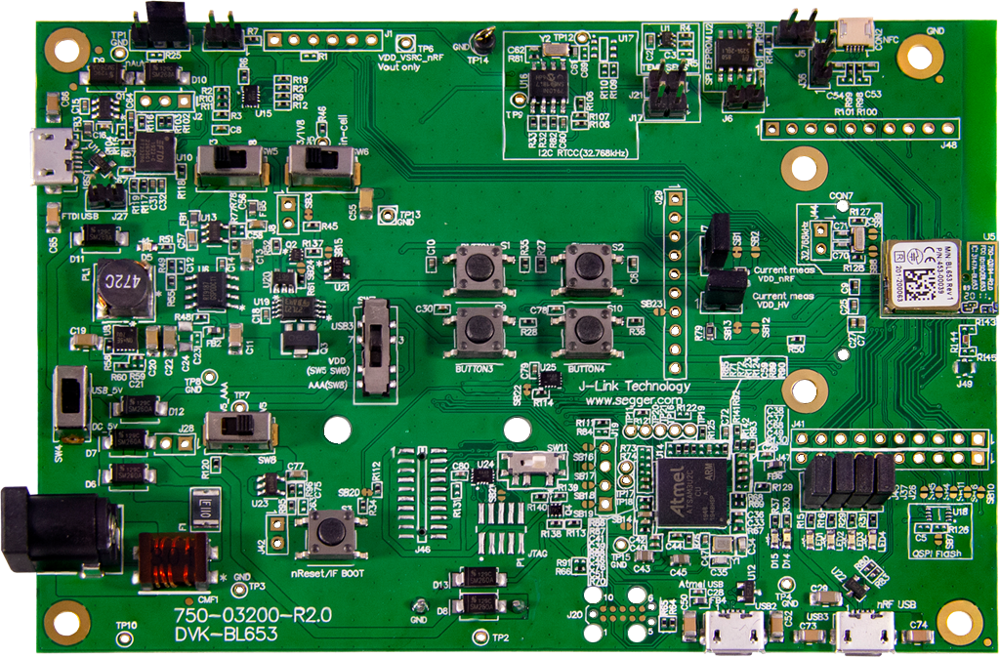

<logo></logo><logo></logo>
#  BL653 Firmware

<table>
  <tr>
    <th align="center">
      
       
      BL653 DVK (<a href="https://www.ezurio.com/part/453-00039-k1">453-00039-k1</a>)
    </th>
    <th align="left">
      <h2>Description</h2>
      Ezurio’s BL653 development kits provide a platform for rapid prototyping of BL653 modules. The development boards provide simple, easy-to-use access to the various hardware interfaces and configuration options for the modules. These DVKs are the perfect platform to provide early development testing of BL653 features and functionality.  
      Please visit the product page on <a href="https://www.ezurio.com/wireless-modules/bluetooth-modules/bluetooth-5-modules/bl653-series-bluetooth-51-802154-nfc-module">ezurio.com</a> for more details.
      <h2>Key Specs</h2>
      <table>
        <tr>
          <td><i>Internal Flash</i></td>
          <td>512 kB</td>
          <td></td>
          <td><i>Internal RAM</i></td>
          <td>128 kB</td>
        </tr>
        <tr>
          <td><i>SPI Flash</i></td>
          <td>None</td>
          <td></td>
          <td><i>Default REPL Port</i></td>
          <td>nRF USB</td>
        </tr>
        <tr>
          <td><i>Python Heap Size</i></td>
          <td>~41 kB</td>
          <td></td>
          <td><i>Filesystem Size</i></td>
          <td>32 kB</td>
        </tr>
      </table>
      <h2>External Links</h2>
      <a href="https://www.ezurio.com/documentation/datasheet-bl653-series">BL653 Series Datasheet</a> 
      <a href="https://www.ezurio.com/documentation/user-guide-bl653-development-kit">BL653 DVK User Guide</a>
    </th>
  </tr>
</table>

## Pinout Diagram [🔗](#pinout_diagram)

## Canvas Features [🔗](#canvas_features)
| | | | | | | | |
|--:|:--|---|--:|:--|---|--:|:-- |
|   | Bootloader           | |   | OTA Update                | |  | RTC                       |
|  | SPI                  | |  | ADC                       | |   | PWM                       |
|  | I2C                  | |  | GPIO                      | |  | UART                      |
|   | JSON                 | |  | CBOR                      | |  | NFC Tag                   |
|   | RE                   | |  | Floating Point            | |  | Watchdog Timer            |
|  | BLE Advertiser       | |  | BLE Scanner               | |  | BLE Connection            |
|   | .zip App Update      | |  | mbedTLS                   | |  |                           |

## Hardware-Specific Features [🔗](#hardware_specific_features)
| | | | | | | | |
|--:|:--|---|--:|:--|---|--:|:--|
|  | USB          | |  | RTOS Shell       | |   | Encrypted FS     |
|  | Modem        | |  | Ethernet         | |   | Wi-Fi Station    |
|  | Wi-Fi AP     | |  | Net Client       | |   | Net Server       |
|  | UWB Ranging  | |  | LED Strip Driver | |  |                  |

## Design Guidelines [🔗](#design_guidelines)
**IMPORTANT**
- Pin P0.11 is used by the mcuboot bootloader to enter recovery mode when logic low at boot.
- Pin P0.13 is used by the mcuboot bootloader as its LED indicator. This will be active high if in bootloader recovery mode.
- Due to limited internal Flash available on the BL653, bootloader and OTA update are disabled by default. To support bootloader and OTA update, an additional external SPI Flash and custom build of Canvas firmware are required. Contact [Ezurio Support](https://www.ezurio.com/contact) to request a custom build of Canvas firmware with external Flash support for your design.

## Build Variants [🔗](#build_variants)
Firmware versions containing `a.b.99` are development builds and may not be suitable for production use.

| | |
|--:|:--|
| dvk                         | Default DVK build, 32 kB filesystem, no external SPI flash. |
| dvk_repl_uart               | Moves REPL console to UART0 |

---
© Copyright 2025 Ezurio LLC
