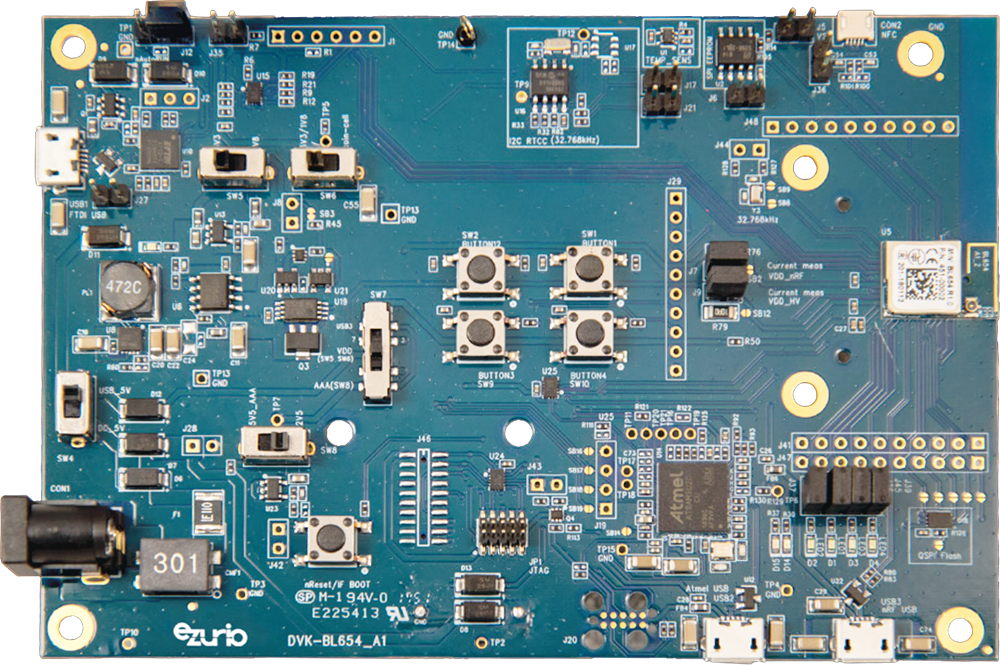

<logo></logo><logo></logo>
#  BL654 Firmware

<table>
  <tr>
    <th align="center">
      
       
      BL654 DVK (<a href="https://www.ezurio.com/part/455-00001">455-00001</a>)
    </th>
    <th align="left">
      <h2>Description</h2>
      Ezurio’s BL654 development kits provide a platform for rapid prototyping of BL654 modules. The development boards provide simple, easy-to-use access to the various hardware interfaces and configuration options for the modules. These DVKs are the perfect platform to provide early development testing of BL654 features and functionality.  
      Please visit the product page on <a href="https://www.ezurio.com/wireless-modules/bluetooth-modules/bluetooth-5-modules/bl654-series-bluetooth-module-nfc">ezurio.com</a> for more details.
      <h2>Key Specs</h2>
      <table>
        <tr>
          <td><i>Internal Flash</i></td>
          <td>1024 kB</td>
          <td></td>
          <td><i>Internal RAM</i></td>
          <td>256 kB</td>
        </tr>
        <tr>
          <td><i>SPI Flash</i></td>
          <td><a href="#build_variants">See variants</a></td>
          <td></td>
          <td><i>Default REPL Port</i></td>
          <td>nRF USB</td>
        </tr>
        <tr>
          <td><i>Python Heap Size</i></td>
          <td>~160 kB</td>
          <td></td>
          <td><i>Filesystem Size</i></td>
          <td><a href="#build_variants">See variants</a></td>
        </tr>
      </table>
      <h2>External Links</h2>
      <a href="https://www.ezurio.com/documentation/datasheet-bl654">BL654 Series Datasheet</a> 
      <a href="https://www.ezurio.com/documentation/user-guide-quick-start-guide-bl654-dvk">BL654 DVK User Guide</a>
    </th>
  </tr>
</table>

## Pinout Diagram [🔗](#pinout_diagram)

## Canvas Features [🔗](#canvas_features)
| | | | | | | | |
|--:|:--|---|--:|:--|---|--:|:-- |
|  | Bootloader           | |  | OTA Update                | |  | RTC                       |
|  | SPI                  | |  | ADC                       | |  | PWM                       |
|  | I2C                  | |  | GPIO                      | |  | UART                      |
|  | JSON *               | |  | CBOR                      | |  | NFC Tag                   |
|   | RE                   | |  | Floating Point            | |  | Watchdog Timer            |
|  | BLE Advertiser       | |  | BLE Scanner               | |  | BLE Connection            |
|   | .zip App Update      | |  | mbedTLS                   | |  |                           |

\* Available on external flash variants

## Hardware-Specific Features [🔗](#hardware_specific_features)
| | | | | | | | |
|--:|:--|---|--:|:--|---|--:|:--|
|  | USB          | |  | RTOS Shell       | |   | Encrypted FS     |
|  | Modem        | |  | Ethernet         | |   | Wi-Fi Station    |
|  | Wi-Fi AP     | |  | Net Client       | |   | Net Server       |
|  | UWB Ranging  | |  | LED Strip Driver | |  |                  |

## Design Guidelines [🔗](#design_guidelines)
$\textsf{\color{salmon}{IMPORTANT}}$
- Pin P0.11 is used by the mcuboot bootloader to enter recovery mode when logic low at boot.
- Pin P0.13 is used by the mcuboot bootloader as its LED indicator. This will be active high if in bootloader recovery mode.
- Default build uses internal RC as the 32kHz source (default hardware configuration for BL654 DVK)
- External SPI NOR flash optional.
  - MX25R40 (512 kB) approved part - on the DVK
  - GD25Q16E (2048 kB) approved part
  - MX25R6435F (8192 kB) approved part

## Build Variants [🔗](#build_variants)
Firmware versions containing `a.b.99` are development builds and may not be suitable for production use.

- `int_flash` images use only the internal flash memory of the BL654.
- `ext_flash` images use external SPI flash memory for the filesystem and/or firmware update slot. Build is configured for 32.768kHz oscillator.
- `can` images are for use with the [MikroE CAN FD 6 Click](https://www.mikroe.com/can-fd-6-click)

| | |
|--:|:--|
| dongle                      | Targets the [BL654 USB dongle (451-00004)](https://www.ezurio.com/part/451-00004). |
| dvk                         | Default DVK build, 64 kB filesystem, no external SPI flash. |
| dvk_can                     | Includes CAN bus support. Filesystem size 1088 kB in ext SPI flash, 32.768kHz osc. required.   |
| dvk_can_debug               | Includes CAN bus support. Filesystem size 1088 kB in ext SPI flash, 32.768kHz osc. required. Debug build - CAN bus debug output on UART0. |
| dvk_ext_flash_2mb_gd25q16e  | Increases filesystem size to 1088 kB|
| dvk_ext_flash_512kb_mx25r40 | Increases filesystem size to 512 kB |
| dvk_repl_uart               | REPL on UART0.                      | 
| dvk_repl_uart_ext_flash_8mb_mx25r6435f | REPL on UART0. Filesystem size 6144 kB in ext SPI flash, 32.768kHz osc. required.  |

---
© Copyright 2025 Ezurio LLC
