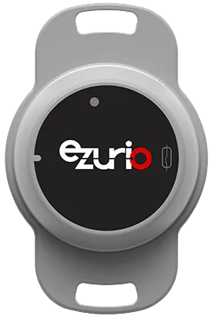
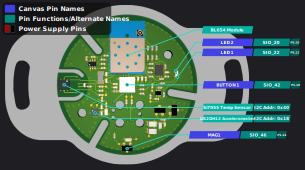

<logo></logo><logo></logo>
#  Sentrius BT510 Firmware

<table>
  <tr>
    <th align="center">
      
       
      Sentrius™ BT510 Sensor (<a href="https://www.ezurio.com/part/455-00083">455-00083</a>)
    </th>
    <th align="left">
      <h2>Description</h2>
      The Sentrius™ BT510 Sensor is a battery powered, IP67-rated Bluetooth 5 Long Range open development device for robust sensor performance in the harshest environments. The ultra-low power Sentrius™ BT510 packs temperature, door open/close, and motion/impact sensing with Bluetooth LE beaconing.   
      It’s powered by Ezurio's field-proven BL654 module (Nordic nRF52840) for feature rich development in the Cortex M4F with 1 MB Flash memory for data logging and storage. Its single replaceable CR2477 coin cell battery enables multi-year life and hassle-free, long-term maintenance.   
      Please visit the product page on <a href="https://www.ezurio.com/iot-devices/bluetooth-iot-devices/bt510-bluetooth-5-long-range-ip67-multi-sensor">ezurio.com</a> for more details.
      <h2>Key Specs</h2>
      <table>
        <tr>
          <td><i>Internal Flash</i></td>
          <td>1024 kB</td>
          <td></td>
          <td><i>Internal RAM</i></td>
          <td>256 kB</td>
        </tr>
        <tr>
          <td><i>SPI Flash</i></td>
          <td>Not Available</td>
          <td></td>
          <td><i>Default REPL Port</i></td>
          <td>UART0</td>
        </tr>
        <tr>
          <td><i>Python Heap Size</i></td>
          <td>~167 kB</td>
          <td></td>
          <td><i>Filesystem Size</i></td>
          <td>96 kB</td>
        </tr>
      </table>
      <h2>External Links</h2>
      <a href="https://www.ezurio.com/documentation/hardware-guide-bt510-sensor-firmware-development">BT510 Hardware Guide</a> 
      <a href="https://www.ezurio.com/documentation/product-brief-usb-swd-programming-kit">USB - SWD Programming Kit</a> (Required for development)
    </th>
  </tr>
</table>

## Pinout Diagram [🔗](#pinout_diagram)

## Canvas Features [🔗](#canvas_features)
| | | | | | | | |
|--:|:--|---|--:|:--|---|--:|:-- |
|  | Bootloader           | |  | OTA Update                | |  | RTC                       |
|  | SPI                  | |  | ADC                       | |   | PWM                       |
|  | I2C                  | |  | GPIO                      | |  | UART                      |
|   | JSON                 | |  | CBOR                      | |   | NFC Tag                   |
|   | RE                   | |   | Floating Point            | |  | Watchdog Timer            |
|  | BLE Advertiser       | |  | BLE Scanner               | |  | BLE Connection            |
|   | .zip App Update      | |  | mbedTLS                   | |  |                           |

## Hardware-Specific Features [🔗](#hardware_specific_features)
| | | | | | | | |
|--:|:--|---|--:|:--|---|--:|:--|
|   | USB          | |   | RTOS Shell       | |   | Encrypted FS     |
|   | Modem        | |   | Ethernet         | |  | Wi-Fi Station    |
|  | Wi-Fi AP     | |  | Net Client       | |  | Net Server       |
|   | UWB Ranging  | |   | LED Strip Driver | |  |                  |

## Design Guidelines [🔗](#design_guidelines)
- Flash programming and development with the BT510 sensor requires the [Ezurio USB - SWD programming kit](https://www.ezurio.com/wireless-modules/programming-kits/usb-swd-programming-kit) (or equivalent SWD programmer with [TC2050-IDC Tag Connect](https://www.tag-connect.com/product/tc2050-idc-tag-connect-2050-idc) adapter)
- Use the [pyocd tool](https://pyocd.io/) to flash Canvas firmware .hex files.

## Build Variants [🔗](#build_variants)
Firmware versions containing `a.b.99` are development builds and may not be suitable for production use.

**Builds within `erase` subfolders are for utility use only, not development. These builds boot and erase the flash-based filesystem.**

| | |
|--:|:--|
| standard                       | Default BT510 sensor build.     |

---
© Copyright 2025 Ezurio LLC
