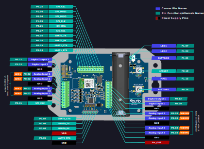

<logo></logo><logo></logo>
#  Sentrius BT610 Firmware

<table>
  <tr>
    <th align="center">
      
       
      Sentrius™ BT610 Sensor (<a href="https://www.ezurio.com/part/450-00121">450-00121-K1</a>)
    </th>
    <th align="left">
      <h2>Description</h2>
      Ezurio's Sentrius™ BT610 I/O Sensor is a battery-operated Bluetooth 5 open development device that helps turn your wired sensors into wireless nodes via robust, secure, and cloud ready messaging. It leverages our BL654 module for full industrial and equipment monitoring applications.  
      Please visit the product page on <a href="https://www.ezurio.com/iot-devices/bluetooth-iot-devices/sentrius-bt610-io-sensor">ezurio.com</a> for more details.
      <h2>Key Specs</h2>
      <table>
        <tr>
          <td><i>Internal Flash</i></td>
          <td>1024 kB</td>
          <td></td>
          <td><i>Internal RAM</i></td>
          <td>256 kB</td>
        </tr>
        <tr>
          <td><i>SPI Flash</i></td>
          <td>8192 kB</td>
          <td></td>
          <td><i>Default REPL Port</i></td>
          <td>UART0</td>
        </tr>
        <tr>
          <td><i>Python Heap Size</i></td>
          <td>~169 kB</td>
          <td></td>
          <td><i>Filesystem Size</i></td>
          <td>7168 kB</td>
        </tr>
      </table>
      <h2>External Links</h2>
      <a href="https://www.ezurio.com/documentation/bt610-hardware-configuration-and-installation-guide">BT610 Hardware Configuration and Installation Guide</a> 
      <a href="https://www.ezurio.com/documentation/application-note-ac-current-sensor-demo">Canvas AC Current Sensor Demo</a> 
      <a href="https://www.ezurio.com/documentation/product-brief-usb-swd-programming-kit">USB - SWD Programming Kit</a> (Required for development)
    </th>
  </tr>
</table>

## Pinout Diagram [🔗](#pinout_diagram)

## Canvas Features [🔗](#canvas_features)
| | | | | | | | |
|--:|:--|---|--:|:--|---|--:|:-- |
|  | Bootloader           | |  | OTA Update                | |  | RTC                       |
|  | SPI                  | |  | ADC                       | |   | PWM                       |
|  | I2C                  | |  | GPIO                      | |  | UART                      |
|   | JSON                 | |  | CBOR                      | |   | NFC Tag                   |
|   | RE                   | |  | Floating Point            | |  | Watchdog Timer            |
|  | BLE Advertiser       | |  | BLE Scanner               | |  | BLE Connection            |
|   | .zip App Update      | |  | mbedTLS                   | |  |                           |

## Hardware-Specific Features [🔗](#hardware_specific_features)
| | | | | | | | |
|--:|:--|---|--:|:--|---|--:|:--|
|   | USB          | |   | RTOS Shell       | |   | Encrypted FS     |
|   | Modem        | |   | Ethernet         | |   | Wi-Fi Station    |
|   | Wi-Fi AP     | |   | Net Client       | |   | Net Server       |
|   | UWB Ranging  | |   | LED Strip Driver | |  |                  |

## Design Guidelines [🔗](#design_guidelines)
- Flash programming and development with the BT610 sensor requires the [Ezurio USB - SWD programming kit](https://www.ezurio.com/wireless-modules/programming-kits/usb-swd-programming-kit) (or equivalent SWD programmer with an [ARM Cortex M 0.05" pitch SWD debug header](https://www.segger.com/products/debug-probes/j-link/accessories/adapters/9-pin-cortex-m-adapter/))
- Use the [pyocd tool](https://pyocd.io/) to flash Canvas firmware .hex files.

## Build Variants [🔗](#build_variants)
Firmware versions containing `a.b.99` are development builds and may not be suitable for production use.

**Builds within `erase` subfolders are for utility use only, not development. These builds boot and erase the flash-based filesystem.**

| | |
|--:|:--|
| standard                       | Default BT610 sensor build.     |

---
© Copyright 2025 Ezurio LLC
