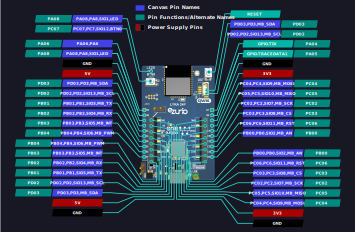

<logo></logo><logo></logo>
#  Lyra24 Firmware

<table>
  <tr>
    <th align="center">
      
       
      Lyra™ 24 P10 (<a href="https://www.ezurio.com/part/453-00142-k1">453-00142-k1</a>)
    </th>
    <th align="left">
      <h2>Description</h2>
      The Lyra 24P Development Kit has been designed to simplify IoT development with the Lyra 24P wireless module. The kit includes a mikroBUS™
socket and Qwiic® connector, allowing users to add features to the kit with a large selection of off-the-shelf boards.  
Programming the Lyra 24P Development Kit is easily done using a USB Micro-B cable and the on-board J-Link debugger and a USB virtual COM port
provides a serial connection to the target application.  
The kit provides 20 breakout pads for peripherals from the Lyra 24P such as I2C, SPI, UART and GPIOs. The mikroBUS socket allows inserting mikroBUS add-on boards which interface with the Lyra 24P through SPI, UART or I2C. The Qwiic connector can be used to connect hardware from the Qwiic Connect System through I2C.  
      Please visit the product page on <a href="https://www.ezurio.com/wireless-modules/bluetooth-modules/bluetooth-5-modules/lyra-24-series-bluetooth-5-modules">ezurio.com</a> for more details.
      <h2>Key Specs</h2>
      <table>
        <tr>
          <td><i>Internal Flash</i></td>
          <td>1536 kB</td>
          <td></td>
          <td><i>Internal RAM</i></td>
          <td>256 kB</td>
        </tr>
        <tr>
          <td><i>SPI Flash</i></td>
          <td>None</td>
          <td></td>
          <td><i>Default REPL Port</i></td>
          <td>EUSART0 (USB VCOM)</td>
        </tr>
        <tr>
          <td><i>Python Heap Size</i></td>
          <td>128 kB</td>
          <td></td>
          <td><i>Filesystem Size</i></td>
          <td>128 kB</td>
        </tr>
      </table>
      <h2>External Links</h2>
      <a href="https://www.ezurio.com/documentation/datasheet-sera-nx040-series">Lyra 24 P10 Datasheet</a> 
      <a href="https://www.ezurio.com/documentation/user-guide-sera-nx040-dvk">Sera NX040 DVK User Guide</a> 
      <a href="https://www.ezurio.com/documentation/user-guide-sera-nx040-software">Sera Nx040 Software User Guide</a>
    </th>
  </tr>
</table>
<h2>Supported Hardware Variants</h2>
<table>
  <tr>
    <td>453-00142-K1</td><td>Lyra 24P Series - Development Kit - Bluetooth PCB Module (10dBm) with integrated antenna</td>
  </tr>
  <tr>
    <td>453-00145-K1</td><td>Lyra 24P Series - Development Kit - Bluetooth PCB Module (20dBm) with integrated antenna</td>
  </tr>
  <tr>
    <td>453-00148-K1</td><td>Lyra 24P Series - Development Kit - Bluetooth PCB Module (20dBm) with RF Trace Pad</td>
  </tr>
  <tr>
    <td>453-00170-K1</td><td>Development Kit, SIP, LYRA 24S, Integrated Antenna</td>
  </tr>
</table>

## Pinout Diagram [🔗](#pinout_diagram)

## Canvas Features [🔗](#canvas_features)
| | | | | | | | |
|--:|:--|---|--:|:--|---|--:|:-- |
|  | Bootloader           | |  | OTA Update                | |  | RTC                       |
|  | SPI                  | |  | ADC                       | |   | PWM                       |
|  | I2C                  | |  | GPIO                      | |  | UART                      |
|  | JSON                 | |  | CBOR                      | |   | NFC Tag                   |
|  | RE                   | |  | Floating Point            | |  | Watchdog Timer            |
|  | BLE Advertiser       | |  | BLE Scanner               | |  | BLE Connection            |
|  | .zip App Update      | |  | mbedTLS                   | |  |                           |

## Hardware-Specific Features [🔗](#hardware_specific_features)
| | | | | | | | |
|--:|:--|---|--:|:--|---|--:|:--|
|   | USB          | |   | RTOS Shell       | |   | Encrypted FS     |
|   | Modem        | |   | Ethernet         | |   | Wi-Fi Station    |
|   | Wi-Fi AP     | |   | Net Client       | |   | Net Server       |
|   | UWB Ranging   | |  | LED Strip Driver | |  |                  |

## Design Guidelines [🔗](#design_guidelines)
- Make sure to use the Canvas firmware build matching the specific Lyra 24 series part you are using.

## Build Variants [🔗](#build_variants)
Firmware versions containing `a.b.99` are development builds and may not be suitable for production use.

| | |
|--:|:--|
| dvk_p10               | Default Lyra 24P10 DVK build |
| dvk_p20               | Default Lyra 24P20 DVK build |
| dvk_prf               | Default Lyra 24P RF Trace DVK build |
| dvk_s10               | Default Lyra 24S DVK build |
| usb_p20               | Default Lyra 24P USB dongle build |

---
© Copyright 2025 Ezurio LLC
