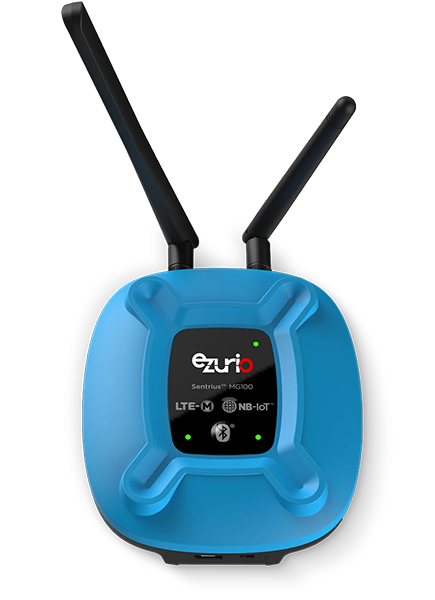

<logo></logo><logo></logo>
#  Sentrius MG100 Firmware

<table>
  <tr>
    <th align="center">
      
       
      Sentrius™ MG100 Gateway (<a href="https://www.ezurio.com/part/450-00054-k1">450-00054-K1 Shown</a>)
    </th>
    <th align="left">
      <h2>Description</h2>
      The Sentrius™ MG100 is a Python scriptable Bluetooth Low Energy (BLE) to LTE-M/NB-IoT cellular gateway supporting low power IoT solutions. With the addition of the optional battery backup, it provides uninterrupted cloud connectivity to BLE devices. Sentrius MG100 bridges BLE and the cloud.  
      Based on Ezurio's Pinnacle™ 100 modem, the Sentrius MG100 Gateway communicates with Bluetooth 5 devices providing a relay to the cloud via a global low power cellular LTE-M/NB-IoT connection (supports LTE bands 1, 2, 3, 4, 5, 8, 12, 13, 20, and 28). The embedded Nordic nRF52840-based radio supports features like CODED PHY, 2M PHY, and LE Advertising Extensions.  
      Please visit the product page on <a href="https://www.ezurio.com/iot-devices/bluetooth-iot-devices/sentrius-mg100-gateway-lte-mnb-iot-and-bluetooth-5">ezurio.com</a> for more details.
      <h2>Key Specs</h2>
      <table>
        <tr>
          <td><i>Internal Flash</i></td>
          <td>1024 kB</td>
          <td></td>
          <td><i>Internal RAM</i></td>
          <td>256 kB</td>
        </tr>
        <tr>
          <td><i>SPI Flash</i></td>
          <td>8192 kB</td>
          <td></td>
          <td><i>Default REPL Port</i></td>
          <td>UART0 (via USB)</td>
        </tr>
        <tr>
          <td><i>Python Heap Size</i></td>
          <td>~81 kB</td>
          <td></td>
          <td><i>Filesystem Size</i></td>
          <td>6144 kB</td>
        </tr>
      </table>
      <h2>External Links</h2>
      <a href="https://www.ezurio.com/documentation/hardware-guide-mg100-gateway">MG100 Hardware Guide</a> 
      <a href="https://www.ezurio.com/documentation/product-brief-usb-swd-programming-kit">USB - SWD Programming Kit</a> (Flash programming adapter) 
      <a href="https://www.tag-connect.com/product/tc2030-idc-6-pin-tag-connect-plug-of-nails-spring-pin-cable-with-legs">Tag-Connect TC2030-IDC</a> (Matches SWD footprint)
    </th>
  </tr>
</table>
<h2>Supported Hardware Variants</h2>
<table>
  <tr>
    <td>450-00011-K1</td><td>Internal Antenna, No Battery</td>
  </tr>
  <tr>
    <td>450-00038-K1</td><td>Internal Antenna, Lithium Ion 18650 Backup Battery</td>
  </tr>
  <tr>
    <td>450-00039-K1</td><td>External Antenna, No Battery</td>
  </tr>
  <tr>
    <td>450-00054-K1</td><td>External Antenna, Lithium Ion 18650 Backup Battery</td>
  </tr>
</table>

## Pinout Diagram [🔗](#pinout_diagram)

**NOTE:** Pins prefixed with HL7800 route directly to the HL7800 modem and are not accessible from Python.

## Canvas Features [🔗](#canvas_features)
| | | | | | | | |
|--:|:--|---|--:|:--|---|--:|:-- |
|  | Bootloader           | |  | OTA Update                | |  | RTC                       |
|  | SPI                  | |  | ADC                       | |   | PWM                       |
|  | I2C                  | |  | GPIO                      | |  | UART                      |
|  | JSON                 | |  | CBOR                      | |  | NFC Tag                   |
|  | RE                   | |  | Floating Point            | |  | Watchdog Timer            |
|  | BLE Advertiser       | |  | BLE Scanner               | |  | BLE Connection            |
|   | .zip App Update      | |  | mbedTLS                   | |  |                           |

## Hardware-Specific Features [🔗](#hardware_specific_features)
| | | | | | | | |
|--:|:--|---|--:|:--|---|--:|:--|
|    | USB          | |   | RTOS Shell       | |   | Encrypted FS     |
|   | Modem        | |   | Ethernet         | |   | Wi-Fi Station    |
|    | Wi-Fi AP     | |  | Net Client       | |   | Net Server       |
|    | UWB Ranging  | |   | LED Strip Driver | |  |                  |

## Design Guidelines [🔗](#design_guidelines)
- Flash programming of the MG100 gateway is available via J5 Tag-Connect footprint. J5 is compatible with [Tag-Connect TC2030-IDC](https://www.tag-connect.com/product/tc2030-idc-6-pin-tag-connect-plug-of-nails-spring-pin-cable-with-legs) or [TC2030-CTX ARM® Cortex™-M4 CPU](https://www.tag-connect.com/product/tc2030-ctx-6-pin-cable-for-arm-cortex) line of plug-of-nail cables and requires this [ARM20-CTX Adapter](https://www.tag-connect.com/product/arm20-ctx-20-pin-to-tc2030-idc-adapter-for-cortex) or [J-Link 9-Pin Cortex-M Adapter](https://www.segger.com/products/debug-probes/j-link/accessories/adapters/9-pin-cortex-m-adapter/). The [Ezurio USB - SWD programming kit](https://www.ezurio.com/wireless-modules/programming-kits/usb-swd-programming-kit) or equivalent SWD programmer may be used, though the TC2030-IDC Tag Connect adapter must be purchased separately.

- Use the [pyocd tool](https://pyocd.io/) to flash Canvas firmware .hex files.

## Build Variants [🔗](#build_variants)
Firmware versions containing `a.b.99` are development builds and may not be suitable for production use.

**Builds within `erase` subfolders are for utility use only, not development. These builds boot and erase the flash-based filesystem.**

| | |
|--:|:--|
| standard                       | Default MG100 gateway build.     |

---
© Copyright 2025 Ezurio LLC
