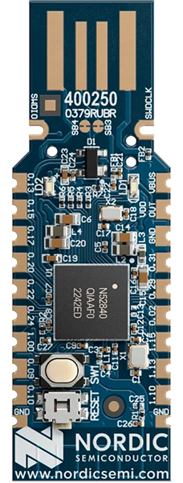

<logo></logo><logo></logo>
#  nrf52840 Firmware

<table>
  <tr>
    <th align="center">
      
       
      Nordic nRF52840 Dongle (<a href="https://www.nordicsemi.com/Products/Development-hardware/nRF52840-Dongle">PCA10059</a>)
    </th>
    <th align="left">
      <h2>Description</h2>
The nRF52840 Dongle is a small, low-cost USB dongle that supports Bluetooth 5.4, Bluetooth mesh, Thread, Zigbee, 802.15.4, ANT and 2.4 GHz proprietary protocols. The Dongle is the perfect target hardware for use with nRF Connect for Desktop as it is low-cost but still support all the short range wireless standards used with Nordic devices.  
Custom applications can be compiled and downloaded to the Dongle. It has a user programmable RGB LED, a green LED, a user programmable button as well as 15 GPIO accessible from castellated solder points along the edge.
      <h2>Key Specs</h2>
      <table>
        <tr>
          <td><i>Internal Flash</i></td>
          <td>1024 kB</td>
          <td></td>
          <td><i>Internal RAM</i></td>
          <td>256 kB</td>
        </tr>
        <tr>
          <td><i>SPI Flash</i></td>
          <td>None</td>
          <td></td>
          <td><i>Default REPL Port</i></td>
          <td>nRF USB</td>
        </tr>
        <tr>
          <td><i>Python Heap Size</i></td>
          <td>~155 kB</td>
          <td></td>
          <td><i>Filesystem Size</i></td>
          <td>380 kB</td>
        </tr>
      </table>
      <h2>External Links</h2>
      <a href="https://www.nordicsemi.com/-/media/Software-and-other-downloads/Product-Briefs/nRF52840-Dongle-product-brief.pdf">nRF52840 Dongle product brief</a> 
    </th>
  </tr>
</table>

## Pinout Diagram [🔗](#pinout_diagram)

## Canvas Features [🔗](#canvas_features)
| | | | | | | | |
|--:|:--|---|--:|:--|---|--:|:-- |
|  | Bootloader *         | |   | OTA Update                | |  | RTC                       |
|  | SPI                  | |   | ADC                       | |   | PWM                       |
|   | I2C                  | |  | GPIO                      | |  | UART                      |
|   | JSON                 | |  | CBOR                      | |   | NFC Tag                   |
|   | RE                   | |  | Floating Point            | |  | Watchdog Timer            |
|  | BLE Advertiser       | |  | BLE Scanner               | |  | BLE Connection            |
|   | .zip App Update      | |  | mbedTLS                   | |  |                           |

\* Supports the Nordic DFU bootloader only

## Hardware-Specific Features [🔗](#hardware_specific_features)
| | | | | | | | |
|--:|:--|---|--:|:--|---|--:|:--|
|  | USB          | |  | RTOS Shell       | |   | Encrypted FS     |
|  | Modem        | |  | Ethernet         | |   | Wi-Fi Station    |
|  | Wi-Fi AP     | |  | Net Client       | |   | Net Server       |
|  | UWB Ranging  | |  | LED Strip Driver | |  |                  |

## Design Guidelines [🔗](#design_guidelines)
**IMPORTANT**
- Pressing the RESET button places the dongle into nRF DFU/bootloader mode. This mode is only useful for programming firmware (e.g., Canvas) to the device using nrfutil or the nRFConnect Desktop Programmer.
- If using mcuboot, Pin P1.06 is used by the mcuboot bootloader to enter recovery mode when logic low at boot. *(NOTE: default Canvas firmware variant does not use mcuboot on this part.)*
- If using mcuboot, Pin P0.06 is used by the mcuboot bootloader as its LED indicator. This is active high if in bootloader recovery mode. *(NOTE: default Canvas firmware variant does not use mcuboot on this part.)*

## Build Variants [🔗](#build_variants)
Firmware versions containing `a.b.99` are development builds and may not be suitable for production use.

| | |
|--:|:--|
| dongle                      | Targets the [Nordic nRF52840 dongle (PCA10059)](https://www.nordicsemi.com/Products/Development-hardware/nRF52840-Dongle). |

---
© Copyright 2025 Ezurio LLC
