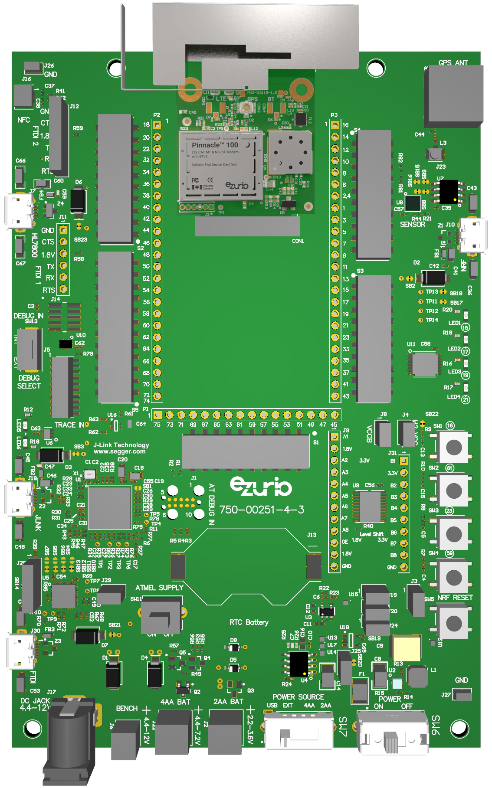
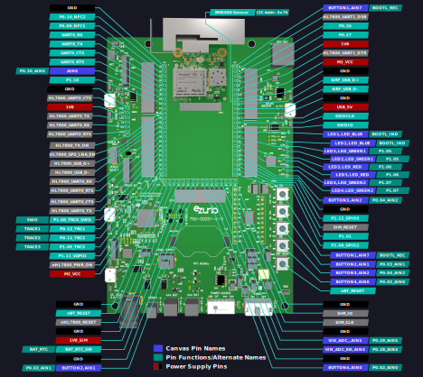

<logo></logo><logo></logo>
#  Pinnacle 100 Firmware

<table>
  <tr>
    <th align="center">
      
       
      Pinnacle™ 100 DVK (<a href="https://www.ezurio.com/part/453-00010-k1">453-00010-K1</a>)
    </th>
    <th align="left">
      <h2>Description</h2>
      The Pinnacle™ 100 modem seamlessly incorporates a powerful Cortex M4F controller, full Bluetooth v5 and LTE-M/NB-IoT capabilities – all with full regulatory certifications and LTE carrier approvals. It offers Python scriptable access to Bluetooth Low Energy (BLE) and LTE-M/NB-IoT cellular functions supporting low power IoT solutions. Pinnacle 100 bridges BLE and the cloud.  
      Ezurio's Pinnacle™ 100 modem communicates with Bluetooth 5 devices providing a relay to the cloud via a global low power cellular LTE-M/NB-IoT connection (supports LTE bands 1, 2, 3, 4, 5, 8, 12, 13, 20, and 28) powered by the Sierra HL7800. The embedded Nordic nRF52840-based radio supports features like CODED PHY, 2M PHY, and LE Advertising Extensions.  
      Please visit the product page on <a href="https://www.ezurio.com/wireless-modules/cellular-solutions/pinnacle-100-cellular-lte-m-nb-iot-bluetooth-5-modem">ezurio.com</a> for more details.
      <h2>Key Specs</h2>
      <table>
        <tr>
          <td><i>Internal Flash</i></td>
          <td>1024 kB</td>
          <td></td>
          <td><i>Internal RAM</i></td>
          <td>256 kB</td>
        </tr>
        <tr>
          <td><i>SPI Flash</i></td>
          <td>8192 kB</td>
          <td></td>
          <td><i>Default REPL Port</i></td>
          <td>nRF USB</td>
        </tr>
        <tr>
          <td><i>Python Heap Size</i></td>
          <td>~81 kB</td>
          <td></td>
          <td><i>Filesystem Size</i></td>
          <td>6144 kB</td>
        </tr>
      </table>
      <h2>External Links</h2>
      <a href="https://www.ezurio.com/documentation/datasheet-pinnacle-100">Pinnacle 100 Datasheet</a> 
      <a href="https://www.ezurio.com/documentation/software-user-guide-mg100-and-pinnacle-100">Software User Guide</a> 
    </th>
  </tr>
</table>
<h2>Supported Hardware Variants</h2>
<table>
  <tr>
    <td>453-00010</td><td>Internal Antenna</td>
  </tr>
  <tr>
    <td>453-00011</td><td>External Antenna</td>
  </tr>
</table>

## Pinout Diagram [🔗](#pinout_diagram)

## Canvas Features [🔗](#canvas_features)
| | | | | | | | |
|--:|:--|---|--:|:--|---|--:|:-- |
|  | Bootloader           | |  | OTA Update                | |  | RTC                       |
|  | SPI                | |    | ADC                       | |   | PWM                       |
|  | I2C                  | |  | GPIO                      | |  | UART                      |
|  | JSON                 | |  | CBOR                      | |  | NFC Tag                   |
|  | RE                   | |  | Floating Point            | |  | Watchdog Timer            |
|  | BLE Advertiser       | |  | BLE Scanner               | |  | BLE Connection            |
|  | .zip App Update      | |  | mbedTLS                   | |  |                           |

## Hardware-Specific Features [🔗](#hardware_specific_features)
| | | | | | | | |
|--:|:--|---|--:|:--|---|--:|:--|
|    | USB          | |   | RTOS Shell       | |   | Encrypted FS     |
|   | Modem        | |   | Ethernet         | |   | Wi-Fi Station    |
|    | Wi-Fi AP     | |  | Net Client       | |   | Net Server       |
|    | UWB Ranging  | |   | LED Strip Driver | |  |                  |

## Design Guidelines [🔗](#design_guidelines)
$\textsf{\color{salmon}{IMPORTANT}}$
- Pin P0.31 is used by the mcuboot bootloader to enter recovery mode when logic low at boot.
- Pin P1.04 is used by the mcuboot bootloader as its LED indicator. This will be active high if in bootloader recovery mode.

## Build Variants [🔗](#build_variants)
Firmware versions containing `a.b.99` are development builds and may not be suitable for production use.

**Builds within `erase` subfolders are for utility use only, not development. These builds boot and erase the flash-based filesystem.**

| | |
|--:|:--|
| dvk                       | Default Pinnacle 100 DVK build.     |

---
© Copyright 2025 Ezurio LLC
