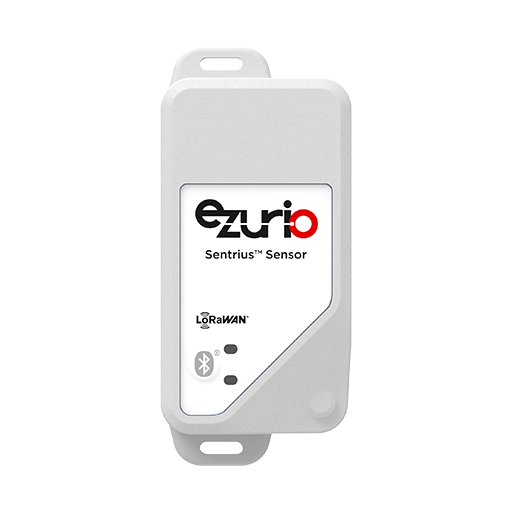

<logo></logo><logo></logo>
#  Sentrius RS26x Firmware

<table>
  <tr>
    <th align="center">
      
       
      Sentrius™ RS26x Sensor (<a href="https://www.ezurio.com/part/450-00104-k1">450-00104-K1 shown</a>)
    </th>
    <th align="left">
      <h2>Description</h2>
      The Sentrius™ RS26x LoRa-Enabled sensor from Ezurio is the ultimate in secure, scalable, robust LoRa solutions for end-to-end control of your
private LoRaWAN network. Based on the Semtech SX1261 / SX1262 chipset, it offers long range up to ten miles, perfect for highly scalable,
flexible IoT networks.  
The Sentrius™ RS26x incorporates a LoRaWAN v1.0.4 compliant LoRaWAN implementation for uplink of sensor data and a BLE v5.4 compliant
implementation for local configuration and firmware update.  
The Sentrius™ RS26x sensor works with the Sentrius™ RG1xx gateways for simple out-of-the-box integration and is compatible with third party and LoRa network servers.   
      Please visit the product page on <a href="https://www.ezurio.com/iot-devices/lorawan-iot-devices/rs26x-sensor">ezurio.com</a> for more details.
      <h2>Key Specs</h2>
      <table>
        <tr>
          <td><i>Internal Flash</i></td>
          <td>1536 kB</td>
          <td></td>
          <td><i>Internal RAM</i></td>
          <td>256 kB</td>
        </tr>
        <tr>
          <td><i>SPI Flash</i></td>
          <td>8192 kB</td>
          <td></td>
          <td><i>Default REPL Port</i></td>
          <td>N/A</td>
        </tr>
        <tr>
          <td><i>Python Heap Size</i></td>
          <td>128 kB</td>
          <td></td>
          <td><i>Filesystem Size</i></td>
          <td>128 kB</td>
        </tr>
      </table>
      <h2>External Links</h2>
      <a href="https://www.ezurio.com/documentation/user-guide-rs26x-series">Sentrius RS26x User Guide</a> 
    </th>
  </tr>
</table>
<h2>Supported Hardware Variants</h2>
<table>
    <tr><td>450-00104-K1</td><td>Sentrius™ RS262 – LoRaWAN / BLE Internal Temperature Sensor. North America (Single)</td></tr>
    <tr><td>450-00040-K1</td><td>Sentrius™ RS261 – LoRaWAN / BLE Internal Temperature Sensor. Europe / UK (Single)</td></tr>
    <tr><td>450-00129-K1</td><td>Sentrius™ RS262 – LoRaWAN / BLE Internal Temperature Sensor. Australia (Single)</td></tr>
    <tr><td>450-00105-K1</td><td>Sentrius™ RS262 – LoRaWAN / BLE Internal Temperature Sensor. New Zealand (Single)</td></tr>
    <tr><td>450-00133-K1</td><td>Sentrius™ RS262 – LoRaWAN / BLE Sensor inc External Thermistor Probe. North America (Single)</td></tr>
    <tr><td>450-00041-K1</td><td>Sentrius™ RS261 – LoRaWAN / BLE Sensor inc External Thermistor Probe. Europe / UK (Single)</td></tr>
    <tr><td>450-00161-K1</td><td>Sentrius™ RS262 – LoRaWAN / BLE Sensor inc External Thermistor Probe. Australia (Single)</td></tr>
    <tr><td>450-00153-K1</td><td>Sentrius™ RS262 – LoRaWAN / BLE Sensor inc External Thermistor Probe. New Zealand (Single)</td></tr>
</table>

## Canvas Features [🔗](#canvas_features)
| | | | | | | | |
|--:|:--|---|--:|:--|---|--:|:-- |
|  | Bootloader           | |  | OTA Update                | |  | RTC                       |
|  | SPI                  | |  | ADC                       | |   | PWM                       |
|  | I2C                  | |  | GPIO                      | |  | UART                      |
|  | JSON                 | |  | CBOR                      | |   | NFC Tag                   |
|  | RE                   | |  | Floating Point            | |  | Watchdog Timer            |
|  | BLE Advertiser       | |  | BLE Scanner               | |  | BLE Connection            |
|  | .zip App Update      | |  | mbedTLS                   | |  |                           |

## Hardware-Specific Features [🔗](#hardware_specific_features)
| | | | | | | | |
|--:|:--|---|--:|:--|---|--:|:--|
|   | USB          | |   | RTOS Shell       | |   | Encrypted FS     |
|   | Modem        | |   | Ethernet         | |   | Wi-Fi Station    |
|   | Wi-Fi AP     | |   | Net Client       | |   | Net Server       |
|   | UWB Ranging   | |  | LED Strip Driver | |  |                  |

## Design Guidelines [🔗](#design_guidelines)
- Canvas application development on the Sentrius RS26x platform requires a development agreement with Ezurio. Please [contact us](https://www.ezurio.com/support) if you are interested in building a custom application with the Sentrius RS26x sensor.

## Build Variants [🔗](#build_variants)
Firmware versions containing `a.b.99` are development builds and may not be suitable for production use.

| | |
|--:|:--|
| standard              | Default Sentrius RS26x sensor build |

---
© Copyright 2025 Ezurio LLC
