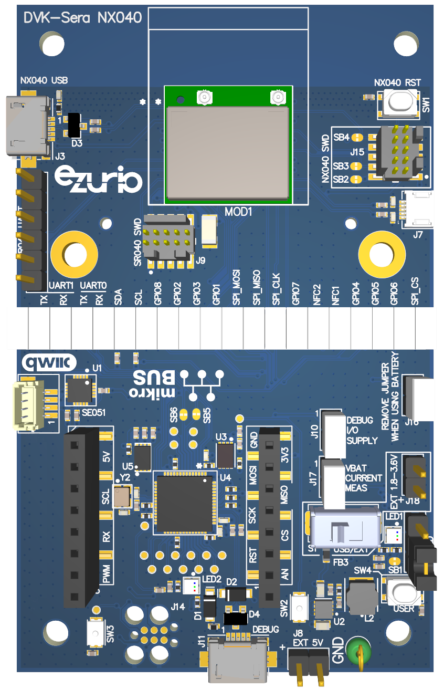
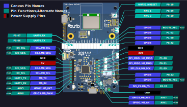

<logo></logo><logo></logo>
#  Sera NX040 Firmware

<table>
  <tr>
    <th align="center">
      
       
      Sera™ NX040 DVK (<a href="https://www.ezurio.com/part/453-00174-k1">453-00174-k1</a>)
    </th>
    <th align="left">
      <h2>Description</h2>
      Ezurio’s Sera NX040 development kits provide a platform for rapid prototyping of UWB ranging applications based on Sera NX040 modules. The kits provide easy-to-use access to various hardware interfaces including mikroBUS and QWIIC headers offering compatibility with hundreds of peripheral boards. These DVKs are the perfect platform to evaluate Bluetooth Low Energy and UWB ranging features.  
      Please visit the product page on <a href="https://www.ezurio.com/wireless-modules/ultra-wideband-modules/sera-nx040-series-uwb-bluetooth-le-nfc-modules">ezurio.com</a> for more details.
      <h2>Key Specs</h2>
      <table>
        <tr>
          <td><i>Internal Flash</i></td>
          <td>512 kB</td>
          <td></td>
          <td><i>Internal RAM</i></td>
          <td>128 kB</td>
        </tr>
        <tr>
          <td><i>SPI Flash (on-module)</i></td>
          <td>1024 kB</td>
          <td></td>
          <td><i>Default REPL Port</i></td>
          <td>UART1</td>
        </tr>
        <tr>
          <td><i>Python Heap Size</i></td>
          <td>~48 kB</td>
          <td></td>
          <td><i>Filesystem Size</i></td>
          <td>448 kB</td>
        </tr>
      </table>
      <h2>External Links</h2>
      <a href="https://www.ezurio.com/documentation/datasheet-sera-nx040-series">Sera NX040 Datasheet</a> 
      <a href="https://www.ezurio.com/documentation/user-guide-sera-nx040-dvk">Sera NX040 DVK User Guide</a> 
      <a href="https://www.ezurio.com/documentation/user-guide-sera-nx040-software">Sera Nx040 Software User Guide</a>
    </th>
  </tr>
</table>
<h2>Supported Hardware Variants</h2>
<table>
  <tr>
    <td>453-00174-K1</td><td>Development Kit, Module, Sera NX040, MHF4L</td>
  </tr>
  <tr>
    <td>453-00175-K1</td><td>Development Kit, Module, Sera NX040, Trace Antenna</td>
  </tr>
</table>

## Pinout Diagram [🔗](#pinout_diagram)

**NOTE:** *LED1* is a WS2812 compatible addressable RGB LED driven by GPIO6. The [canvas.LEDStrip](https://lairdcp.github.io/canvas_python_docs/canvas.html#canvas.LEDStrip) class can be used to control this LED.

## Click Pinout Table [🔗](#pinout_table_click)
| Pin | Canvas Pin Strings |
|-----|--------------------|
| GPIO_7 | BUTTON |

## DVK Pinout Table [🔗](#pinout_table_dvk)
| Pin | Canvas Pin Strings |
|-----|--------------------|
| UART1_TX | MB_TX |
| UART1_RX | MB_RX |
| I2C_SDA | SDA,MB_SDA |
| I2C_SCL | SCL,MB_SCL |
| GPIO_8 | GPIO8,MB_RST |
| GPIO_2 | GPIO2,MB_INT |
| GPIO_3 | GPIO3,MB_PWM |
| GPIO_1 | GPIO1,MB_AN |
| SPI_MOSI_EXT | SPI_MOSI,MB_MOSI |
| SPI_MISO_EXT | SPI_MISO,MB_MISO |
| SPI_CLK_EXT | SPI_CLK,MB_SCK |
| GPIO_7 | GPIO7 |
| NFC_2 | NFC2 |
| NFC_1 | NFC1 |
| GPIO_4 | GPIO4 |
| GPIO_5 | GPIO5 |
| GPIO_6 | GPIO6 |
| SPI_CS_EXT | SPI_CS,MB_CS |

## Tag Pinout Table [🔗](#pinout_table_tag)
| Pin | Canvas Pin Strings |
|-----|--------------------|
| GPIO_8 | LED5 |
| GPIO_2 | INT1 |
| GPIO_3 | LED4 |
| GPIO_1 | LED3 |
| GPIO_7 | BUTTON |
| GPIO_4 | LED2 |
| GPIO_5 | INT2 |
| GPIO_6 | LED1 |

## Click Peripheral/Bus Table [🔗](#peripheral_bus_table_click)
| Peripheral/Bus | Canvas Peripheral/Bus Strings |
|---|---|
| I2C | i2c0 |
| SPI | spi1 |
| SPI | spi2 |
| SPI | spi3 |

## DVK Peripheral/Bus Table [🔗](#peripheral_bus_table_dvk)
| Peripheral/Bus | Canvas Peripheral/Bus Strings |
|---|---|
| I2C | i2c0 |
| SPI | spi1 |
| SPI | spi2 |
| SPI | spi3 |

## Tag Peripheral/Bus Table [🔗](#peripheral_bus_table_tag)
| Peripheral/Bus | Canvas Peripheral/Bus Strings |
|---|---|
| I2C | i2c0 |
| SPI | spi1 |
| SPI | spi2 |

## Canvas Features [🔗](#canvas_features)
| | | | | | | | |
|--:|:--|---|--:|:--|---|--:|:-- |
|  | Bootloader           | |  | OTA Update                | |  | RTC                       |
|  | SPI                  | |  | ADC                       | |   | PWM                       |
|  | I2C                  | |  | GPIO                      | |  | UART                      |
|   | JSON                 | |  | CBOR                      | |   | NFC Tag                   |
|   | RE                   | |  | Floating Point            | |  | Watchdog Timer            |
|  | BLE Advertiser       | |  | BLE Scanner               | |  | BLE Connection            |
|   | .zip App Update      | |  | mbedTLS                   | |  |                           |

## Hardware-Specific Features [🔗](#hardware_specific_features)
| | | | | | | | |
|--:|:--|---|--:|:--|---|--:|:--|
|   | USB          | |   | RTOS Shell       | |   | Encrypted FS     |
|   | Modem        | |   | Ethernet         | |   | Wi-Fi Station    |
|   | Wi-Fi AP     | |   | Net Client       | |   | Net Server       |
|  | UWB Ranging  | |  | LED Strip Driver | |  |                  |

## Design Guidelines [🔗](#design_guidelines)
**IMPORTANT**
- Pin P1.03 is used by the mcuboot bootloader to enter recovery mode when logic low at boot.
- The SPI flash included in the Sera NX040 module contains an NXP SR040 firmware image. This firmware image must be present to operate the UWB radio so performing a full erase of the SPI flash is not recommended.

## Build Variants [🔗](#build_variants)
Firmware versions containing `a.b.99` are development builds and may not be suitable for production use.

| | |
|--:|:--|
| dvk               | Default DVK build |
| tag               | Targets the Sera NX040 tag development board |
| click             | Targets the [Sera NX040 click board](https://www.mikroe.com/uwb-4-click) |

---
© Copyright 2025 Ezurio LLC
