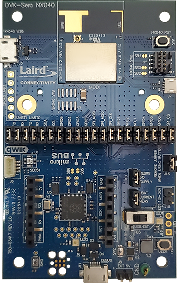
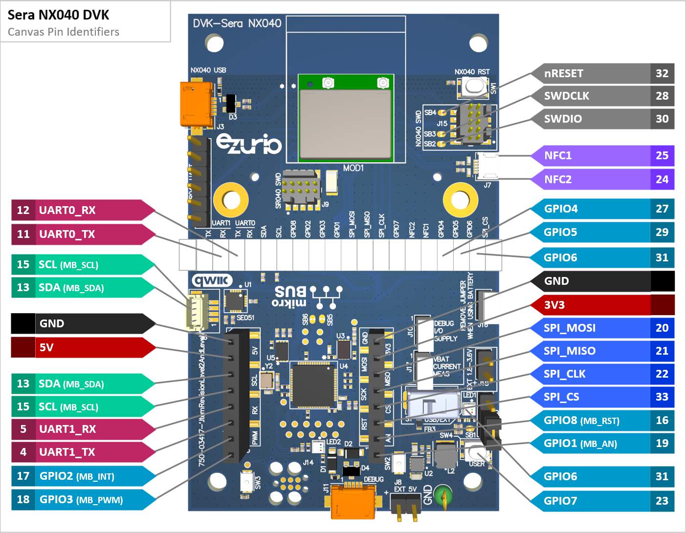

|    Sera NX040 DVK ([453-00175-K1](https://www.ezurio.com/part/453-00175-k1)) | <h2>Description</h2> The Sera NX040 series integrates Bluetooth Low energy connectivity with Ultra-Wide-Band ranging capabilities enabling rapid development of wireless two-way-ranging applications. <h2>Hardware Overview</h2> The Sera NX040 module features a combination of the Nordic nRF52833 SoC and NXP SR040 UWB radio for a powerful hardware platform for wireless tracking applications. <h2>Key Specs</h2><table><tr><td>Internal Flash</td><td>512KB</td></tr><tr><td>Internal RAM</td><td>128KB</td></tr><tr><td>Internal SPI Flash</td><td>8Mbit</td></tr><tr><td>REPL Port</td><td>UART1</td></tr><tr><td>Python Heap Size</td><td>49KB</td></tr></table><h2>External Links</h2>[Sera NX040 Datasheet](https://www.ezurio.com/documentation/datasheet-sera-nx040-series) |
| :-: | :-- |

# Canvas Features
| ON?                               | FEATURE         |  | ON? | FEATURE |  | ON?         | FEATURE          |
| :-:                               | :--             | --- | :-:                            | :--                 | --- | :-:                            | :--              |
|  | Bootloader      |  |  | OTA Update          |  |     | Net Server       |
|  | SPI             |  |  | CBOR                |  |                                   | mbedTLS          |
|  | I2C             |  |  | JSON                |  |  | UWB Ranging      |
|  | GPIO            |  |  | Regular Expressions |  |  | NFC Tag          |
|  | UART            |  |  | Floating Point      |  |  | LED Strip Driver |
|  | RTC             |  |                                   | Encrypted FS        |  |                                   | LwM2M APIs       |
|  | ADC             |  |  | .ZIP App Update     |  |                                   |                  |
|  | USB             |  |                                   | RTOS Shell          |  |                                   |                  |
|                                   | Watchdog Timer  |  |                                   | FW Debug Logs       |  |                                   |                  |
|  | BLE Advertiser  |  |                                   | Modem               |  |                                   |                  |
|  | BLE Scanner     |  |                                   | Ethernet            |  |                                   |                  |
|  | BLE Connection  |  |                                   | Wi-Fi Station       |  |                                   |                  |
|  | BLE GATT Server |  |                                   | Wi-Fi Station       |  |                                   |                  |
|  | BLE GATT Client |  |                                   | Net Client          |  |                                   |                  |

# Hardware Pinout Diagram

# Canvas Sample Links
| *DESCRIPTION* | *LINK* |
| :--           | :-:    |
| <h2>Basic Two-Way-Ranging - Initiator</h2> Configures the UWB radio for a ranging session in an Initiator role. Automatically starts ranging if a nearby radio is configured in Responder role. Distance in cm is displayed on the REPL console. |  |
| <h2>Basic Two-Way-Ranging - Responder</h2> Configures the UWB radio for a ranging session in a Responder role. Ranging starts if a nearby radio configured in Initiator role starts a session. Distance in cm is displayed on the REPL console. |  |
| <h2>2D/3D Positioning Demo</h2> Demonstration script for use with the Xbit 2D/3D positioning visualization applet. The module is configurable as an “anchor” or “tag” and reports ranging data over BLE to the applet. |  |

# Additional Content

## Known Limitations

Some Python features may be disabled due to limited internal Flash size of the nRF52833 part.

Filesystem must contain the NXP-provided binary firmware image for the SR040 UWB radio in order for UWB radio to operate.
