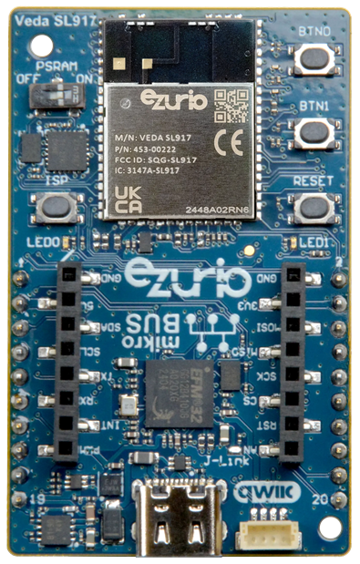
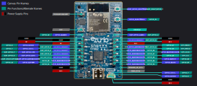

<logo></logo><logo></logo>
#  Veda SL917 Firmware (Pre-Release)

<table>
  <tr>
    <th align="center">
      
       
      Veda SL917 Explorer Kit (<a href="https://www.ezurio.com/part/453-00222-k1">453-00222-K1</a>)
    </th>
    <th align="left">
      <h2>Description</h2>
      The Veda SL917 Module Wi-Fi 6 and Bluetooth LE Explorer Kit is focused on rapid prototyping and concept creation of IoT applications. It is designed around the SL917 SoC module based upon Silicon Labs SiWx917 chipset, which is an ideal module family for developing energy-friendly connected IoT applications.  
      The Ezurio Explorer kit features a USB Type-C interface, an on-board SEGGER J-Link debugger, two user-LEDs and two buttons, and support for hardware add-on boards via a mikroBus socket and a Qwiic connector. The hardware add-on support allows developers to create and prototype applications using a virtually endless combination of off-the-shelf peripheral boards from MIKROE, SparkFun, Adafruit, and Seeed Studio.  
      Please visit the product page on <a href="https://www.ezurio.com/product/veda-sl917-wi-fi-6-bluetooth-le-5-4-module">ezurio.com</a> for more details.
      <h2>Key Specs</h2>
      <table>
        <tr>
          <td><i>QSPI Flash</i></td>
          <td>8192 kB</td>
          <td></td>
          <td><i>Internal RAM</i></td>
          <td>672 kB</td>
        </tr>
        <tr>
          <td><i>Python Heap Size (w/QSPI PSRAM)</i></td>
          <td>~160 kB (8192 kB)</td>
          <td></td>
          <td><i>Default REPL Port</i></td>
          <td>ULP_UART</td>
        </tr>
        <tr>
          <td></td>
          <td></td>
          <td></td>
          <td><i>Filesystem Size</i></td>
          <td>1024 kB</td>
        </tr>
      </table>
      <h2>External Links</h2>
      <a href="https://www.ezurio.com/documentation/datasheet-veda-sl917-soc-module">Veda SL917 SoC Datasheet</a> 
      <a href="https://www.ezurio.com/documentation/user-guide-veda-sl917-explorer-board">Veda SL917 Explorer Kit User Guide</a>
    </th>
  </tr>
</table>

## Pinout Diagram [🔗](#pinout_diagram)

## Canvas Features [🔗](#canvas_features)
| | | | | | | | |
|--:|:--|---|--:|:--|---|--:|:-- |
|   | Bootloader*          | |   | OTA Update*               | |  | RTC                       |
|  | SPI                  | |  | ADC                       | |  | PWM                       |
|  | I2C                  | |  | GPIO                      | |  | UART                      |
|  | JSON                 | |  | CBOR                      | |  | NFC Tag                   |
|  | RE                   | |  | Floating Point            | |  | Watchdog Timer            |
|  | BLE Advertiser       | |  | BLE Scanner               | |  | BLE Connection            |
|  | .zip App Update      | |  | mbedTLS                   | |  |                           |

\* Planned for official release, not available in current pre-release firmware

## Hardware-Specific Features [🔗](#hardware_specific_features)
| | | | | | | | |
|--:|:--|---|--:|:--|---|--:|:--|
|   | USB          | |   | RTOS Shell       | |   | Encrypted FS     |
|   | Modem        | |   | Ethernet         | |  | Wi-Fi Station    |
|  | Wi-Fi AP     | |  | Net Client       | |  | Net Server       |
|   | UWB Ranging  | |   | LED Strip Driver | |  |                  |

## Design Guidelines [🔗](#design_guidelines)
$\textsf{\color{salmon}{IMPORTANT}}$
- Canvas firmware releases depend on a specific WiSeConnect connectivity firmware version. Both .rps files are provided in each release, be sure to flash both firmware images before developing with Canvas.
- Use Simplicity Commander tool from Silicon Labs to program .rps files.
- External PSRAM support is experimental.

## Build Variants [🔗](#build_variants)
Firmware versions containing `a.b.99` are development builds and may not be suitable for production use.

**Builds within `erase` subfolders are for utility use only, not development. These builds boot and erase the flash-based filesystem.**

| | |
|--:|:--|
| brd2708a                    | SiLabs SiWX917Y SoC Module Explorer Kit build.     |
| brd2708ap                   | Adds External QSPI PSRAM support.                  |
| brd2911a                    | Default Veda SL917 Explorer Kit build.             |
| brd2911ap                   | Adds External QSPI PSRAM support.                  |

---
© Copyright 2025 Ezurio LLC
